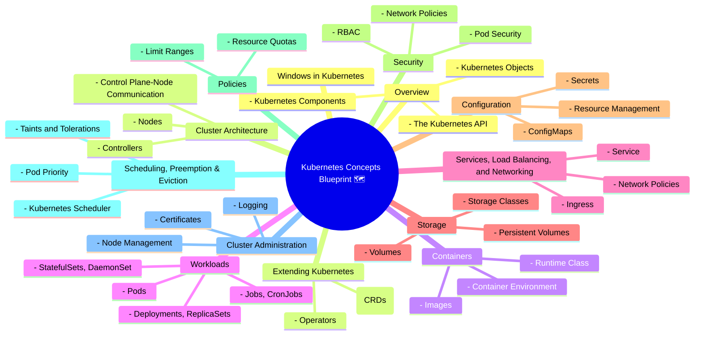

# 🚀 Chapter 0: Kubernetes Concepts - Mana Grand Tour Blueprint!

Namaste, Kubernetes Yodhuda! 🙏

Welcome to our first official step into the world of Kubernetes! Ee page manaki oka Google Maps lanti di. Mana destination ento telusu - Kubernetes ni master cheyadam! Ee map lo unna prathi area ni manam explore cheyabothunnam.

Think of this as the "Table of Contents" for the entire Kubernetes universe. Ee structure ni manam mind lo pettukunte, chinna chinna concepts nerchukunetappudu "idi ekkada fit avtundi?" ane confusion undadu. Everything will click into place.

Let's visualize our journey with a beautiful mindmap! ❤️

## Ee Blueprint Enduku Important? 🤔

*   **Clarity:** Ee mindmap chuste, manam em nerchukuntunnam, adi pedda picture lo ekkada undi anedi clear ga ardam avtundi.
*   **Confidence:** Oka structured path unte, mana journey easy ga anipistundi. "Oh, manam 'Workloads' section lo 'Pods' gurinchi matladukuntunnam" ani meeku telustundi.
*   **Connection:** Prathi concept inkoti danitho ela connect ayyi undo telusukodaniki ee map chala help chestundi. For example, 'Pods' (`Workloads`) ki 'Persistent Volumes' (`Storage`) ela attach cheyalo, 'Services' (`Networking`) tho ela expose cheyalo... antha interconnected!

Idi just starting matrame! Manam prathi section loki deep dive chesi, prathi topic ni post-mortem cheddam. 😂

**Next Enti? (CLIFFHANGER! 🎬)**

Blueprint chusesam kabatti, building kattadam start cheddama? Mana next stop: **Overview**. Asalu Kubernetes ante enti? Dhaani components emiti? Oka application ni manage cheyadaniki adi emi "Objects" vadutundi? Anni telusukundam... in the next episode! Stay tuned! 🫡
