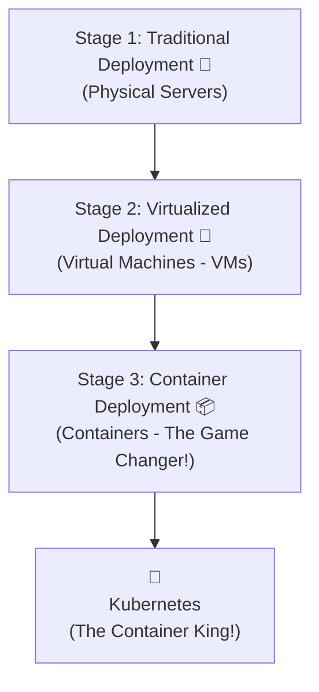

# 🔥 Chapter 1: Kubernetes Overview - Asalu Endi ee K8s?

Right! Mana blueprint ready aipoindi. Ippudu asalu katha loki vellipodam. Meeru adigaru kada, "asala ee container gola enti?" ani. Perfect question! Daaniki answer telistene, Kubernetes enduku antha goppa o telustundi. Let's start from scratch.

## The Evolution Story - Mana Apps ప్రయాణం! 🚗 ➡️ 🚄 ➡️ 🚀

Oka 10-15 years venakki velthe, software ni deploy cheyadam chala different ga undedi. Ee evolution ni ardham cheskunte, K8s power ento clear ga telustundi.

### Stage 1: Traditional Deployment (Physical Servers - The 'Illu Antha Manade' Era)
*   **Analogy:** Imagine meedhi oka pedda independent house (Physical Server).
*   **What we did:** Mana applications (e.g., React app, Java app) anni direct ga aa house lo ne pettesevallam (OS meeda install chesevallam).
*   **Problem 😭:** Oka application (e.g., Java app) ekkuva space, current, water (CPU, RAM, Disk) vadeskunte, inko application (React app) ki resources undevi kaadu. Result? Slow performance!
*   Inko solution, prathi application ki oka separate house (physical server) kottadi konadam. Kani adi chala costly and resources waste avtayi.

### Stage 2: Virtualized Deployment (VMs - The 'Apartment' Era)
*   **Analogy:** Ippudu aa pedda house ni demolish chesi, oka apartment complex (Hypervisor on Physical Server) kattam. Andulo chala individual flats (Virtual Machines - VMs) unnayi.
*   **What we did:** Prathi flat (VM) ki daani sonta water tank, current meter, walls (dedicated resources, own OS) untayi. So, oka flat lo unde vallu (oka application) inkokarini disturb cheyaru.
*   **Problem 🤔:** Better, kani prathi flat (VM) ki separate ga full OS (Windows, Linux) install cheyali. Idi chala heavy and slow. Oka chinna React app kosam, mottham OS ni run cheyadam ante... scooter meeda America vellinattu undi. 😂 Resources still underutilized to some extent.

### Stage 3: Container Deployment (Containers - The 'Backpack' Era) 🔥
*   **Analogy:** Ippudu manam smart aipoyam. Apartment (Physical Server with one OS) okate. Kani prathi application ki కావలసినవన్నీ (code, libraries, dependencies) ఒక சின்ன backpack (Container) లో సర్ది, ఆ backpack ని apartment లో ఎక్కడ కావాలంటే అక్కడ పెట్టుకుంటున్నాం.
*   **What happened:** Ee containers anni apartment (Host OS) resources ni share cheskuntayi, kani okati okati separate ga untayi (isolated).
*   **Advantage 🫡:** Chala lightweight! Oka full OS ni load cheyanavasaram ledu. Seconds lo start avtayi. Mee React app, Spring Boot app... anni vaati vaati "backpacks" lo happy ga untayi. Ee container concept ni popular chesinde **Docker**.
*   **The REAL Problem:** Ok, 10 containers manage cheyochu. 100? 1000? Oka container crash aite evaru chustaru? Load ekkuva aite inko container ni evaru start chestaru? Avi okati okati ela matladukuntayi? Ikkade mana hero entry istadu!

## So, Why Kubernetes? (K8s Enduku Vachadu?)

Aa paina cheppina container gola ni manage cheyadanike Kubernetes vachindi. Adi oka **Container Orchestration Platform**.
Simple ga cheppalante, Kubernetes is the **Manager for your containers**. Dhaani pani containers ni chuskovadam.

### What K8s can do for us? (Mana Kosam Em Chestundi?)
*   **Service discovery and load balancing:** Oka 10 React app containers unte, traffic ni automatic ga distribute chestundi. Ee container ekkada undi ani manam search cheyakarledu.
*   **Storage orchestration:** Mana container ki data store cheskovadaniki storage kavali ante, automatic ga mount chestundi (local storage or cloud storage like AWS EBS).
*   **Automated rollouts and rollbacks:** "Ee 10 containers ni new version tho update chey" ante, adi okati okati carefully update chestundi. Edo problem vaste, ventane "rollback" chesi old version ki vellipotundi. Downtime undadu!
*   **Automatic bin packing:** Meeku unna servers (Nodes) lo, ee container ni ekkada pedithe resources baga use avtayo adi automatic ga decide cheskuntundi.
*   **Self-healing ❤️‍🩹:** Health check petti, "Emaindi ra, pani cheyatleda?" ani adugutundi. Container fail aite, daanini theesesi kottadi start chestundi. Manam nidra potunna, adi pani chestune untundi.
*   **Secret and configuration management:** Passwords, API keys lanti sensitive information ni safe ga store chesi, containers ki andistundi.
*   **Horizontal scaling:** "Traffic ekkuva undi, 10 containers ni 100 chey" ante, okka command tho chesestundi.

### What K8s is NOT! (Idi Cheyaledu Babai!)
Ee point chala important. Lite teeskokandi.
*   **It doesn't build your code:** Me Spring boot code ni compile chesi, JAR/WAR build cheyadu. Adi mee CI/CD pipeline (like Jenkins, GitLab CI) pani.
*   **It is not a Database or Middleware:** Meeku database (MySQL) or message queue (Kafka) kavalante, adi provide cheyadu. Kani, vaatini kuda container ga package chesi, Kubernetes meeda run cheyochu!
*   **It is not a traditional PaaS (Platform as a Service):** Heroku lanti PaaS kadu idi. PaaS lo anni ready-made ga untayi, K8s lo building blocks istadu, manam manaku kavalsinattu assemble cheskovali. More power, more flexibility!

Phew! That's the overview. Hope meeku "container gola" and "K8s enduku" anedi clear aindi anukuntunna.

**Next Enti? (CLIFFHANGER! 🎬)**

Okay, Kubernetes oka manager anukunnam. Mari aa manager team lo evaru unnaru? Aa team members (Components) enti? Vaallu ela pani chestaru? Let's meet the team behind the magic: **The Kubernetes Components**. Control Plane, Kubelet, etcd... ee perlu vini untaru, vaati asalu pani ento next chapter lo chuddam! Stay curious! 🤗
