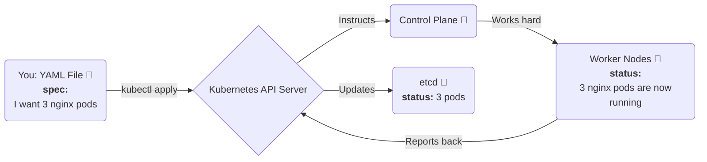

# 📜 Chapter 3: Kubernetes Objects - The Language of K8s

Namaste! 🙏 Welcome back. Mana K8s team (Components) gurinchi telusukunnaka, ippudu asalu question: "Veellatho manam ela matladali? How do we tell them what to do?"

The answer is **Kubernetes Objects**.

Think of it like this: Meeru oka restaurant ki vellaru.
*   Meeru waiter ki cheppe order (e.g., "oka biryani, two rotis") - adi **Desired State**.
*   Kitchen lo chef aa order ni prepare cheyadam - adi **Kubernetes System at work**.
*   Mee table meeda food ravadam - adi **Actual State**.

Kubernetes lo, manam ilanti orders ni **Objects** roopamlo istham. Ee objects ni manam `YAML` files lo రాసి, `kubectl` ane command tho cluster ki submit chestam.

## The Declarative Model: "Nuvvu Cheppu, Nenu Chesta"

Idi Kubernetes lo most powerful concept. Manam "HOW" to do things cheppam (imperative). Manam just "WHAT" we want cheptam (declarative).

*   **You say:** "Naku 3 copies of my React app run avvali." (This is the `spec` or desired state).
*   **Kubernetes does:** It checks the current status. "Oh, 0 copies unnayi." It then works tirelessly to create 3 copies and make the `status` (actual state) match your `spec`.

Ee `spec` and `status` anevi prathi Kubernetes object lo unde rendu important fields.



## Our First YAML File: The Pod Object

Let's create our first and most basic Kubernetes object: a **Pod**. Oka Pod anedi Kubernetes lo the smallest deployable unit. Simple ga, it's a wrapper around one or more of your containers.

Ikkada oka simple Nginx web server ni run cheyadaniki oka Pod definition chuddam. Prathi line ni in-detail ga break down cheddam.

`example-pod.yaml`
```yaml
apiVersion: v1
kind: Pod
metadata:
  name: my-first-nginx-pod
  labels:
    app: webserver
spec:
  containers:
    - name: nginx-container
      image: nginx:1.14.2
      ports:
        - containerPort: 80
```

### YAML Breakdown (Prathi Line Post-mortem 😂)

*   `apiVersion: v1`
    *   **Analogy:** Idi oka Government form fill chestunnapudu, "Which year's form is this? 2023 or 2024?" ani adiginattu.
    *   **Explanation:** Manam ee object ni create cheyadaniki Kubernetes API lo ఏ version వాడుతున్నామో cheptunnam. Basic objects like Pods, Services anni `v1` lo untayi. More complex ones like Deployments `apps/v1` lo untayi. This is mandatory.

*   `kind: Pod`
    *   **Analogy:** Form lo "Type of Application" field lanti di. (e.g., Passport Application, Driving License Application).
    *   **Explanation:** Manam ఏ type of object create chestunnamo cheptunnam. Ikkada adi `Pod`. It could be `Deployment`, `Service`, `Secret`, etc. This is also mandatory.

*   `metadata:`
    *   **Analogy:** Form lo mee personal details section (Name, Address, etc.).
    *   **Explanation:** Idi object gurinchi data... about the data. 😂 It helps to identify the object.
    *   `name: my-first-nginx-pod`: Manam ee object ki istunna peru. Within a namespace (dani gurinchi tarvata matladukundam), ee peru unique ga undali.
    *   `labels:`: Ivi stickers lanti vi. Manam object ki labels attach cheyochu. Enduku? To organize and select objects later. Ikkada `app: webserver` ane label icham.

*   `spec:`
    *   **THIS IS THE MOST IMPORTANT PART.** Idi mana "record of intent". Mana **order**.
    *   **Explanation:** Ikkade manam object యొక్క desired state ni define chestam. "Naku ee object ila undali" ani cheppedi ikkade.
    *   `containers:`: Oka Pod lo okati or ekkuva containers undochu. So idi oka list.
    *   `- name: nginx-container`: Aa container ki manam istunna peru.
    *   `image: nginx:1.14.2`: The REAL magic. Ee container run cheyadaniki ఏ Docker image కావాలో cheptunnam. Docker Hub nunchi `nginx` image, specific ga `1.14.2` version ni pull cheskuntundi.
    *   `ports:`: Mana container lo unna application ఏ port meeda listen chestundo cheptunnam.
    *   `- containerPort: 80`: Nginx default ga 80 port meeda run avtundi, so adi specify chestunnam.

That's it! You have just understood your first Kubernetes YAML file line-by-line. Not that difficult, right? 🫡

**Next Enti? (CLIFFHANGER! 🎬)**

Okay, manam object ni `name` and `labels` tho define chesam. Kani cluster lo vanda laకొద్దీ objects unte? Vatini manage cheyadam ela? Prathi object ki oka unique ID ఉంటుందా? Labels tho inthaకంటే em cheyochu? What are **Selectors**? Let's uncover the secrets of **Object Management, Names, and Labels** in our very next chapter! Stay tuned! 🤗
