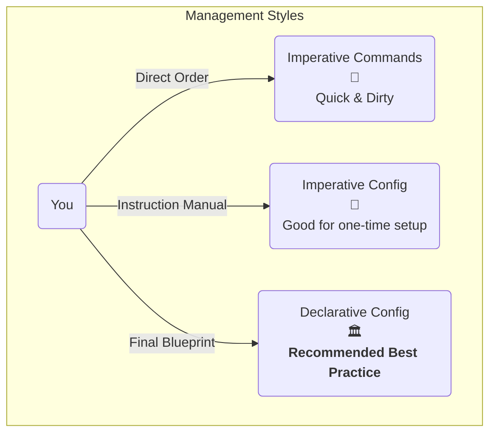

# 🛠️ Chapter 4: Object Management - The 3 Ways to Talk to K8s

Welcome back, mawa! Last chapter lo manam K8s objects and mana first YAML file gurinchi nerchukunnam. Super! Ippudu, aa YAML file ni cluster ki ivvadam ela? Objects ni create, update, delete cheyadam ela? Let's find out.

Kubernetes tho pani cheyadaniki main ga 3 ways unnayi. Ee 3 ways ni ardham cheskovadam chala important because adi mee project complexity and team workflow meeda depend avtundi.

## The 3 Management Techniques - An Analogy

Imagine meeru oka Senior Developer, and meeku oka Junior Developer unnadu. Meeru athaniki pani 3 విధాలుగా cheppochu:

1.  **Imperative Commands:** Junior ni pilichi, "Ee line of code ippude rayi" ani direct ga cheppadam.
2.  **Imperative Config:** Oka document lo instructions anni raasi, "Ee document lo unnadi unnattu chesey" ani cheppadam.
3.  **Declarative Config:** Building final blueprint ichi, "Final output ila undali, em cheyalo nuvve chusko" ani cheppadam.

Let's see this visually:

---

## 1. Imperative Commands (The "Direct Order" Way)

Direct ga `kubectl` command lo ne anni cheppestam. No YAML file needed.

*   **When to use:** Quick testing, development, learning, or one-off tasks kosam perfect.
*   **Problem:** Emi chesamo anedi track undadu. Oka command tarvata, aa object ni ela create chesamo anedi history undadu. Team lo work chestunnapudu idi chala kashtam.

### Key Commands & What they do:

*   `kubectl run my-nginx-pod --image=nginx`
    *   **Pani:** `my-nginx-pod` ane peru tho, `nginx` image tho oka **Pod** ni create chestundi. Chala fast ga oka pod ni test cheyadaniki vadataru.

*   `kubectl create deployment my-nginx-deployment --image=nginx --replicas=3`
    *   **Pani:** Idi oka step munduku velli, oka **Deployment** object ni create chestundi. Ee deployment, 3 copies (`replicas`) of nginx pods ni eppudu run ayyela chuskuntundi.

*   `kubectl expose deployment my-nginx-deployment --port=80 --type=NodePort`
    *   **Pani:** Mana deployment ni cluster bayata nunchi access cheyadaniki oka **Service** ni create chestundi. (Services gurinchi manam tarvata in-detail ga chustam).

*   `kubectl edit deployment my-nginx-deployment`
    *   **Pani:** Live object ni direct ga edit cheyadaniki oka editor open chestundi. Chala risky, not recommended in production!

*   `kubectl delete deployment my-nginx-deployment`
    *   **Pani:** Aa deployment ni, daani kinda unna pods ni... antha lepesthundi (delete).

---

## 2. Imperative Object Configuration (The "Instruction Manual" Way)

Manam mundu chapter lo create chesina laaga, oka YAML file prepare chesi, daanni `kubectl` ki istham.

*   **When to use:** Simple projects ki, or object ni create chesi delete cheseyali ante idi better.
*   **Key Point:** Manam command lo `create`, `replace`, `delete` ani **explicit** ga cheptunnam.

### Key Commands & What they do:

Let's assume we have our `pod.yaml` file.

*   `kubectl create -f pod.yaml`
    *   **Pani:** `pod.yaml` file lo unna object ni create chestundi.
    *   **Gotcha! ⚠️:** If you run this command again, it will give an error saying "already exists".

*   `kubectl replace -f pod.yaml`
    *   **Pani:** Already unna object ni, ee file lo unna new configuration tho **completely replace** chestundi.
    *   **BIG Gotcha! 🚨:** Idi chala dangerous. Kubernetes automatic ga add chesina details (like a `LoadBalancer` IP) kuda ee command tho potayi. So, be very careful.

*   `kubectl delete -f pod.yaml`
    *   **Pani:** YAML file lo unna peru tho match ayye object ni cluster lo vethiki delete chestundi.

---

## 3. Declarative Object Configuration (The "Blueprint" Way) ⭐

**This is the officially recommended approach for production.**

Ikkada manam "create chey", "replace chey" ani cheppam. Manam just mana YAML file ni ichi, "Make sure the cluster looks like this file" ani cheptam. Kubernetes ye aalochinchi, em cheyalo (create, update, or do nothing) decide cheskuntundi.

*   **When to use:** Always! Especially in production, team environments, and CI/CD pipelines.
*   **Key Point:** The source of truth is your YAML file stored in Git, not what's running in the cluster.

### The Magic Command: `kubectl apply`

*   `kubectl apply -f my-app-directory/`
    *   **Pani:** Idi `create` and `replace` ki oka hybrid lanti di, but much smarter.
    *   **First time:** Directory lo unna files ni chusi, objects levu kabatti, create chestundi.
    *   **Second time (after you change the YAML):** `apply` command chala intelligent ga, live object ki and mee file ki madhya **difference** (patch) ni calculate chesi, aa chinna change ni matrame apply chestundi. It doesn't replace the whole object.
    *   **How it works internally:** Kubernetes prathi object ki `last-applied-configuration` ane oka internal annotation maintain chestundi to track changes.
    *   If you delete a file from the directory and run `kubectl apply --prune -l your-label=true`, it will even delete the object from the cluster. Super smart!

## Summary: Which one to use?

| Technique                | Best For                               | Pros ✅                                           | Cons ❌                                                              |
| ------------------------ | -------------------------------------- | ------------------------------------------------- | -------------------------------------------------------------------- |
| **Imperative Commands**  | Learning, Quick Tests, Debugging       | Super fast, simple commands                       | No audit trail, not for teams, not repeatable.                       |
| **Imperative Config**    | Simple, one-off setups                 | Config is in Git, better than commands            | Fails if object exists (`create`), can delete important live changes (`replace`). |
| **Declarative Config**   | **Production & All Serious Work**      | **THE BEST!** Config in Git, smart updates, retains other changes. | Can be slightly complex to debug unexpected merges sometimes.         |

**Final Verdict:** Start learning with Imperative commands, but get into the habit of using **Declarative (`kubectl apply`)** as soon as possible. It will save you from a lot of pain in the long run.

**Next Enti? (CLIFFHANGER! 🎬)**

Okay, manam objects ni ela manage cheyalo nerchukunnam. Kani prathi object ki manam `metadata` lo `name` isthunnam. Aa name rules enti? Can two pods have the same name? Asalu aa `UID` ane concept enti? How do we find and filter hundreds of objects easily using `labels`? Let's uncover the secrets of **Object Names, UIDs, and Labels** in our next exciting chapter! Don't miss it! 😉
