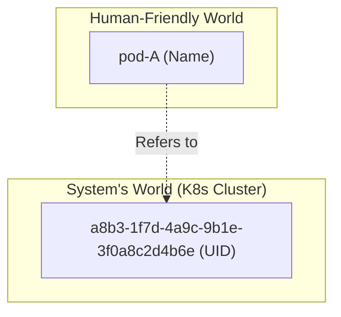

# 🆔 Chapter 5: Object Names and UIDs - Peru, Namam, UID!

Alright mawa, let's get into it. Last chapter lo manam `metadata` lo `name` ane field chusam. Adi anthe na? Leka inka emaina unda? How does Kubernetes tell one object from another, even if they have the same name over time?

Simple. Prathi object ki rendu important identifiers untayi: **Names** and **UIDs**.

## The Name vs. UID Analogy: Peru vs. Aadhaar Card

Ee concept ni ardham cheskovadaniki oka simple analogy:

*   **Name:** Idi mana peru lanti di ("Raju"). Oka class lo iddari peru "Raju" undochu (different classes lo). If one Raju leaves the school and a new Raju joins, the name is reused. It's for us humans to easily identify.
*   **UID (Unique ID):** Idi mana Aadhaar Card number lanti di. It is **universally unique** for life. Oka Raju vellipoyi, kotha Raju vachina, kotha Raju ki kotha Aadhaar number vastundi. Old number is retired forever. This is for the system (Kubernetes) to uniquely identify, no matter what.

---

## 1. Object Names (The 'Display Name' 📛)

Idi manam object create chesetappudu `metadata.name` lo icche peru.

*   **Uniqueness Rule:** Oka object `name` anedi, **oka particular type ki, oka particular namespace lo unique ga undali.**
    *   *Example:* `default` aney namespace lo, `my-pod` ane peru tho okate `Pod` undali.
    *   Kani, `default` namespace lo `my-pod` ane `Pod` and `my-pod` ane `Service` undochu. (Different kinds).
    *   Also, `default` namespace lo `my-pod` and `test` namespace lo `my-pod` undochu. (Different namespaces).

*   **Naming Convention (Important!):** Peru pettadaniki kuda konni rules unnayi. Most resources require a name that follows **DNS Subdomain Name** rules:
    *   Maximum length: **253 characters**.
    *   Only contain: **lowercase alphanumeric characters (a-z, 0-9), hyphen (-), or dot (.)**.
    *   Must start with an alphanumeric character.
    *   Must end with an alphanumeric character.
    *   **Example:** `my-app.v1-prod` is a valid name. `_my-app` or `My-App` are **invalid**.

---

## 2. UIDs (The 'Permanent Record' 🆔)

*   **Who creates it?:** Kubernetes system automatically generates this when an object is created. Manam idi ivvalemu, or change cheyalemu.
*   **Uniqueness:** A UID is unique across the **entire lifetime of the entire cluster**.
*   **The Key Use Case:** Imagine you delete a Pod named `my-pod` at 10:00 AM. At 10:05 AM, you create a new Pod with the *exact same name* `my-pod`.
    *   For you, the name is the same.
    *   But for Kubernetes, the first pod had a UID like `xxxxx-xxxx-1111` and the new pod will have a completely different UID like `yyyyy-yyyy-2222`.
    *   This helps Kubernetes and its controllers to avoid confusion between the old, deleted object and the new one. It's a fundamental concept for reliability.

So, in short: **Names are for humans, UIDs are for the machine.**

**Next Enti? (CLIFFHANGER! 🎬)**

Okay, so we know how to name our objects. But what if we want to group them? How do we tell a Service, "Hey, send traffic to all of my 'frontend' pods"? Or how do we say, "Show me all pods that belong to the 'production' environment"?

Just using names is not enough for this. For this kind of powerful grouping and filtering, Kubernetes gives us an amazing tool: **Labels and Selectors**. Let's explore this next! You're going to love this one! 🤗
