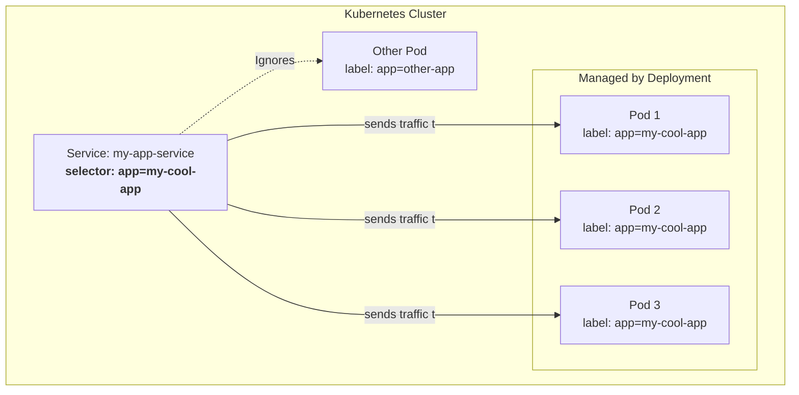

# 🏷️ Chapter 6: Labels & Selectors - The Super Glue of Kubernetes

Mawa, welcome to one of the most powerful and "aha!" moments in Kubernetes. Names and UIDs manaki objects ni identify cheyadaniki help chesayi. But how do we work with *groups* of objects? How does a Service know which Pods to send traffic to?

The answer: **Labels and Selectors**.

## The Analogy: Shopping Mall Lo Tags & Filters 🛍️

Imagine you are in a huge clothing store.
*   **Labels:** Prathi item ki unna price tag or brand tag lanti vi. Ivi simple key-value pairs.
    *   `brand: nike`
    *   `color: black`
    *   `type: shoe`
*   **Selectors:** Meeru sales person ni adagadam lanti di.
    *   "Naku **black color** lo unna **Nike brand** **shoes** chupinchu."
    *   This is a selector! It filters and groups items based on their labels.

Kubernetes lo, ee simple idea ne chala powerful things achieve chestundi.

---

## 1. Labels (The Price Tags 🏷️)

Labels anevi manam mana objects ki attach chese key-value pairs. Veeti main purpose **organization** and **selection**.

*   **Where to define?** `metadata.labels` section lo, just like `name`.
*   **Example:** Mana previous pod ki konni labels add cheddam.

`pod-with-labels.yaml`
```yaml
apiVersion: v1
kind: Pod
metadata:
  name: my-labeled-pod
  labels:
    environment: production
    app: my-web-app
    tier: frontend
spec:
  containers:
  - name: nginx-container
    image: nginx
```
*   **Rules for Labels:**
    *   Keys and values must be 63 characters or less.
    *   They can contain letters, numbers, hyphens, underscores, and dots.
    *   Keys must be unique for an object.

---

## 2. Selectors (The Smart Filter 🔎)

Labels pettadam first step aite, vaatini use chesi objects ni filter cheyadame **Selectors**. Ivi rendu rakalu.

### Type 1: Equality-Based Selectors

Ivi chala simple. `key=value`, `key==value` (both mean equals), or `key!=value` (not equals).

*   **Command-Line Example:** Mana cluster lo `production` environment lo unna `frontend` tier pods anni kavali anukondi:
    ```bash
    kubectl get pods -l 'environment=production,tier=frontend'
    ```
    *   Ikkada comma (`,`) acts as a logical **AND**. Ante, `environment` label `production` **AND** `tier` label `frontend` ga undali.

*   `tier!=frontend` ante, `frontend` tier lo leni anni pods vastayi.

### Type 2: Set-Based Selectors

Ivi konchem more expressive. `in`, `notin`, `exists` ane operators untayi.

*   **Command-Line Example:** `production` or `qa` environment lo unna pods anni kavali anukondi:
    ```bash
    kubectl get pods -l 'environment in (production,qa)'
    ```
    *   Ikkada `in` operator `OR` la pani chestundi.

*   `tier notin (frontend, cache)` ante, `frontend` or `cache` tier lo leni anni pods vastayi.

*   `kubectl get pods -l 'environment'`
    *   `exists` operator lanti di. `environment` ane key unna prathi pod ni select chestundi, value emaina parvaledu.

---

## The Magical Connection: How Services find Pods ✨

This is the most important part. Ikkade asalu magic jarigedi.

Oka **Service** (load balancer lanti di) or oka **Deployment** (mana pod replicas ni manage chesedi) vaatiki ఏ pods sambandhinchinavo ela telusukuntayi? The answer is **labels and selectors**.

Ee YAML chudandi, it's a game changer!

```yaml
# 1. First, we create our pods using a Deployment
apiVersion: apps/v1
kind: Deployment
metadata:
  name: my-app-deployment
spec:
  replicas: 3
  selector: # <-- CHALA IMPORTANT
    matchLabels:
      app: my-cool-app # I will manage any pod with this label
  template: # <-- Pod definition starts here
    metadata:
      labels:
        app: my-cool-app # <-- Pods get this label
    spec:
      containers:
      - name: my-app-container
        image: nginx

---
# 2. Now, we create a Service to expose them
apiVersion: v1
kind: Service
metadata:
  name: my-app-service
spec:
  selector: # <-- CHALA IMPORTANT
    app: my-cool-app # I will send traffic to any pod with this label
  ports:
    - protocol: TCP
      port: 80
      targetPort: 80
```

### Visualizing the Connection:



### Breakdown:

*   **Deployment `spec.selector.matchLabels`:** Deployment ki manam cheptunnam, "Hey, `app: my-cool-app` ane label unna prathi pod nee control lo untundi. Nuvvu 3 replicas maintain cheyali."
*   **Deployment `template.metadata.labels`:** Aa deployment create chese prathi pod ki automatic ga ee `app: my-cool-app` ane label ni attach chestundi.
*   **Service `spec.selector`:** Service ki manam cheptunnam, "Hey, `app: my-cool-app` ane label unna prathi pod ki nenu traffic pampali."

Ee `label-selector` mechanism valla, components anni **loosely coupled** ga untayi. Service ki pods perlu teliyakkarledu, just labels teliste chalu. This is the heart of Kubernetes' flexibility.

**Next Enti? (CLIFFHANGER! 🎬)**

Labels are for identifying and grouping. But what if we want to add extra information to an object that is not used for selection? For example, a description, a link to a monitoring dashboard, or contact info of the person who created it? For this, Kubernetes gives us another type of metadata called **Annotations**. Let's see how they differ from Labels next! Stay sharp! 🧐
