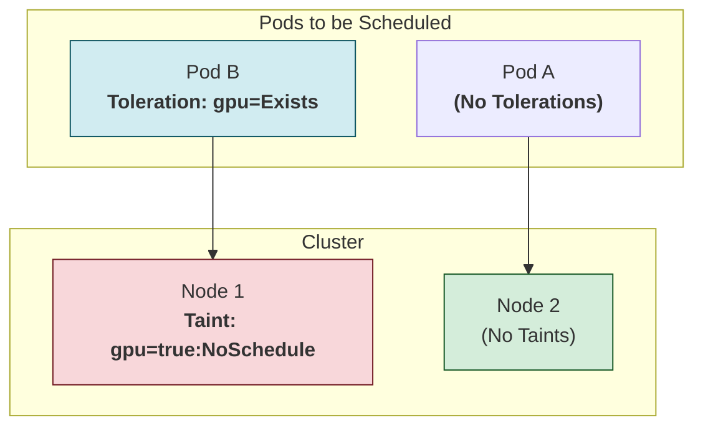

# 📚 Section: Cluster Architecture
# 🛠️ Chapter 1: Nodes - The Workhorses of Kubernetes! 🛠️

Namaste, Champion! Mana last section lo K8s kingdom yokka King, the **API Server**, gurinchi thelusukunnam. King orders pass chestadu, kani aa orders ni execute chesi, asalu pani chesedi evaru? The soldiers, the workers, the actual "people" of the kingdom!

Welcome to the world of **Nodes**! Ee chapter lo manam asalu mana applications ekkada run avthayo, aa physical or virtual machines gurinchi detail ga chuddam.

**What we will learn in this chapter:**
-   What a Node is and what software runs on it.
-   How a Node reports its health (its "heartbeat").
-   The super-important concept of **Taints and Tolerations** to control where our Pods run.

## 1. What is a Node?

-   A Node is simply a **worker machine** in your Kubernetes cluster. It can be a Virtual Machine (VM) from a cloud provider or a physical server in your data center.
-   Deeni main pani okate: to run **Pods**. Asalu mana application containers antha ee Nodes meedane live avthayi.
-   As we saw in **Chapter 2 (Components)**, prathi Node meeda konni essential K8s components run avthayi:
    -   **`kubelet`**: The agent that talks to the control plane.
    -   **`kube-proxy`**: The network magician for that node.
    -   **`Container Runtime`**: The engine that runs containers (like `containerd`).

## 2. Node Status - The Health Report Card 🩺

Prathi Node, oka student la, regular ga `kube-apiserver` ki health report pampistundi. Ee report ni manam `kubectl describe node <node-name>` tho chudochu. Ee report lo konni important sections untayi:

-   **Addresses:** Node yokka IP addresses (`InternalIP`, `ExternalIP`) and its `Hostname`.
-   **Conditions:** Idi chala critical section. It's a list of `True`/`False`/`Unknown` statuses.
    -   `Ready`: Node healthy ga undi, Pods ni accept cheyadaniki ready ga unda? `True` ante ready!
    -   `DiskPressure`: Node meeda disk space aipothunda?
    -   `MemoryPressure`: Node meeda RAM aipothunda?
    -   `PIDPressure`: Too many processes running?
-   **Capacity & Allocatable:**
    -   `Capacity`: Node yokka total resources (e.g., `cpu: 4`, `memory: 16Gi`).
    -   `Allocatable`: Andulo, mana Pods kosam entha available ga undi anedi.
-   **Info:** General info like OS, kernel version, container runtime version.

## 3. Node Heartbeats & The Lease Object ❤️

How does the control plane know if a node is alive or dead (due to a network issue or crash)? Through **heartbeats**.
-   **Old way:** The `kubelet` used to update the entire Node object with its status frequently. But the Node object is very large, so this was inefficient.
-   **New, smart way (Leases):** Ippudu, prathi node `kube-node-lease` aney special namespace lo, tanakantu oka chinna **`Lease`** object ni create cheskuntundi.
-   Every few seconds, the kubelet just updates this tiny Lease object. Idi chala fast and efficient.
-   If the control plane doesn't see an update on this Lease object for a while, it marks the Node as unhealthy. Simple and effective!

## 4. Taints and Tolerations - The Bouncer and the VIP Pass 🚫🎫

Ippudu asalu interesting part ki vacham. How do we control which Pods can run on which Nodes? For example, konni nodes lo powerful GPUs undochu, manam only Machine Learning pods ni matrame akkada run cheyali anukuntam. How?

The answer is **Taints (on Nodes)** and **Tolerations (on Pods)**.

-   **Taint (The "No Entry" Sign):** Nuvvu oka Node ki taint apply chesthe, you are basically putting a "No Entry" sign on it. By default, no Pod will be scheduled there.
-   **Toleration (The "VIP Pass"):** Oka Pod ki toleration isthe, you are giving it a VIP pass that allows it to ignore a matching taint and enter the restricted Node.

**Analogy:**
-   Oka Node anedi oka exclusive party club anukondi.
-   `kubectl taint nodes node1 gpu=true:NoSchedule` anedi aa club mundu **"Only for GPU Members"** ane board pettinattu.
-   Normal Pods (without a pass) will be repelled by the bouncer (the scheduler).
-   Oka Pod YAML lo manam ee kindha unna toleration pedithe, daaniki VIP pass ichinattu.
    ```yaml
    tolerations:
    - key: "gpu"
      operator: "Exists"
      effect: "NoSchedule"
    ```



### Taint Effects (The Types of "No Entry" Signs)

There are three types of taint effects:
1.  **`NoSchedule`**: Don't schedule any new Pods that don't tolerate this taint. Kani, already unna Pods ni emi cheyadu.
2.  **`PreferNoSchedule`**: It's a "soft" version. The scheduler will *try* not to place a Pod here, but if there's no other choice, it might.
3.  **`NoExecute`**: This is the strictest. It will not only prevent new Pods from scheduling, but it will also **kick out (evict)** any currently running Pods that don't tolerate the taint.

> **🧠 Key Takeaway:** **Taints and Tolerations** are the primary mechanism to restrict Pods to specific nodes or to dedicate nodes for special purposes. It's a core concept for managing a real-world cluster.

---

### Cliffhanger 🧗:

We now know what a Node is and what's inside it. We also know how to control which Pods land on it. But how does the `kubelet` on the Node securely talk to the `API Server` in the Control Plane? What does that communication look like? Is it one-way or two-way?

In our next chapter, we will explore the secure channels and the communication patterns that connect the Kubernetes brain to its hands: **Communication between Nodes and the Control Plane**! Get ready to become a network detective! 🕵️‍♂️
