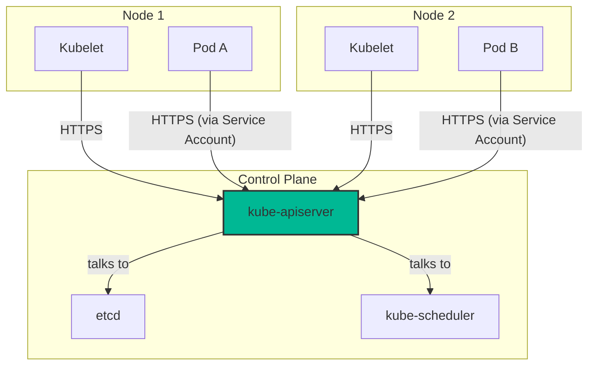
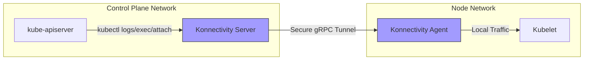

# 🕵️‍♂️ Chapter 2: The Secret Tunnels - CP & Node Communication! 🕵️‍♀️

Hello Detectives! Last chapter lo manam Nodes gurinchi, ante mana K8s cluster yokka soldiers gurinchi thelusukunnam. Kani, aa soldiers ki Control Plane (mana King) nunchi orders ela vasthayi? Vaallu terugu King ki report ela istharu? Antha secret ga, secure ga ela jaruguthundi?

Ee chapter lo manam aa secret communication channels ni crack cheddam! We'll investigate the "hub-and-spoke" model of Kubernetes communication.

## Two Main Communication Highways 🛣️

Imagine two big highways connecting the Control Plane (CP) and the Nodes:
1.  **Node to Control Plane:** Soldiers reporting to the King.
2.  **Control Plane to Node:** The King giving orders to the soldiers.

Let's investigate them one by one!

### 1. Node to Control Plane Communication (The "Hub-and-Spoke" Model)

Idi chala simple and secure. Kubernetes lo, anni communications ki center point, mana **API Server** (the Hub). Prathi Node (the Spoke) and daani meeda run ayye Pods, direct ga API Server thone matladathayi. Vere `etcd` or `scheduler` lanti components tho direct ga matladavu.

-   **How is it secure?** Anni connections **HTTPS** use chesthayi.
-   **Kubelet Security:** `kubelet` ki oka client certificate istharu, so it can prove its identity to the API server.
-   **Pod Security:** Pods ki **Service Accounts** untayi. Kubernetes ee service account use chesi, Pod ki కావలసిన certificate and token automatically inject chestundi. So, the Pod can securely talk to the API server.

> **Key Idea:** Ee "hub-and-spoke" design valla, network rules chala simple ga untayi. Just allow HTTPS traffic to the API server's port (usually 443) from all nodes. Antha secure and clean!

### 2. Control Plane to Node Communication

Ikkade అసలు twist undi! The King needs to talk back to the soldiers. There are two main ways this happens.

#### A. API Server to `kubelet`
Ee connection దేనికి?
-   `kubectl logs`: Pod logs chudadaniki.
-   `kubectl attach`: Running pod loki velladaniki.
-   `kubectl port-forward`: Local machine nunchi pod loki port forward cheyadaniki.

Ee connection `kubelet` yokka HTTPS endpoint ki velthundi. **BUT BEWARE!** By default, the API server **does not verify** the kubelet's certificate. 😱 Ante, man-in-the-middle attack jaragachu.

**How to secure it?**
-   `--kubelet-certificate-authority` aney flag use chesi, API server ki kubelet certificate ni verify cheyమని cheppali.
-   Leda, SSH Tunneling vadali (but this is deprecated).

#### B. API Server to Nodes, Pods, and Services
Idi API server yokka proxy functionality. By default, idi plain HTTP lo untundi. Ante, **not encrypted, not authenticated**. 🙅‍♂️ It's not safe for public networks.

## The Modern Solution: Konnectivity Service 🚀

Ee security headaches anni chusi, Kubernetes oka super solution a introduce chesindi: **Konnectivity Service**. Idi deprecated SSH tunnels ki replacement.

**How it works:**
-   **Konnectivity Server:** Idi Control Plane lo run avthundi.
-   **Konnectivity Agent:** Idi prathi Node lo run avthundi.

The Agent on the node proactively connects to the Server on the control plane and establishes a secure, persistent tunnel. Ippudu, Control Plane nunchi Node ki vache antha traffic ee secure tunnel daawaraane velthundi.

> **🧠 Grand Conclusion:** Node-to-CP communication is simple and secure by default. But CP-to-Node communication is tricky and requires special care. The modern, recommended way to secure it is by using the **Konnectivity Service**.

---

### Cliffhanger 🧗:

Manam ippudu Control Plane and Nodes madhya communication ela untundo chusam. Kani asalu ee Control Plane lo unna components (`api-server`, `scheduler`, `controller-manager`, `etcd`) okati tho okati ela matladukuntayi? What happens inside that "Control Plane" box?

In our next chapter, we will zoom into the brain of Kubernetes and explore the **Control Plane Components** in detail! Are you ready to meet the real masterminds? 🧠
