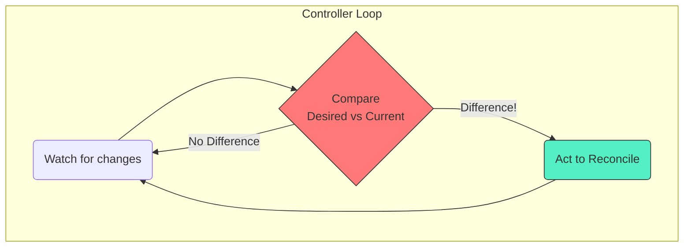

# 🧠 Chapter 3: The Masterminds - Kubernetes Controllers! 🧠

Namaste, Champion! Mana last chapter lo Control Plane and Nodes madhya secret communication ela untundo chusam. Kani, asalu aa "Control Plane" aney box lo emundi? Who are the real brains behind the operation?

Welcome to the world of **Controllers**! Ee chapter lo, manam Kubernetes yokka "auto-pilot" system gurinchi thelusukuntam. The magic that makes Kubernetes self-healing and declarative.

## What is a Controller? The Thermostat Analogy 🌡️

Imagine your AC thermostat. Nuvvu desired temperature (e.g., 24°C) set chestav. The thermostat constantly checks the current room temperature.
-   If it's too hot, it turns the AC on (Action).
-   If it's too cold, it turns the AC off (Action).
-   If it's perfect, it does nothing.

A Kubernetes controller is exactly like that. It's a **control loop** that continuously tries to make the **current state** of the cluster match the **desired state**.

## The Controller Pattern: Watch -> Compare -> Act

Prathi controller ee simple 3-step pattern ni follow avthundi:

1.  **Watch (Observe):** A controller watches for changes to a specific type of resource. For example, a `Deployment` controller watches `Deployment` objects.
2.  **Compare (Diff):** It then compares the desired state (defined in the object's `spec` field) with the current state of the cluster.
3.  **Act (Reconcile):** If there's a difference, the controller takes action to fix it.



### Example: The Deployment Controller in Action!

Let's see how this works for our goal of running a **Spring Boot microservice**. Manam oka `Deployment` object create chesi, "I want 3 replicas of my Spring Boot app" ani cheptam.

**Desired State:** 3 replicas of `my-springboot-app`.
**Current State:** Let's say only 1 replica is running.

The **Deployment Controller** will:
1.  **Watch:** It's always watching `Deployment` objects.
2.  **Compare:** It sees `spec.replicas` is 3, but the actual count is 1. There's a mismatch!
3.  **Act:** It tells the **API Server**, "Hey, create 2 more Pods for this Deployment."

The controller **doesn't create the Pods itself!** It just tells the API Server what to do. The API server then validates this, and the Scheduler and Kubelet do the actual work of placing and running the Pods. This is called **Control via API Server**.

Here's the YAML for our desired state:
```yaml
# springboot-deployment.yaml
apiVersion: apps/v1
kind: Deployment
metadata:
  name: my-springboot-app-deployment
spec:
  replicas: 3 # <-- DESIRED STATE
  selector:
    matchLabels:
      app: my-springboot-app
  template:
    metadata:
      labels:
        app: my-springboot-app
    spec:
      containers:
      - name: springboot-container
        image: my-cool-repo/my-springboot-app:v1
        ports:
        - containerPort: 8080
```
> To apply this, you'd run: `kubectl apply -f springboot-deployment.yaml`. The Deployment Controller would then immediately start working to ensure 3 pods are running.

## Two Types of Control

1.  **Control via API Server (Indirect):** Most controllers work this way. They talk to the API server to manage resources *inside* the cluster (like creating Pods, Services, etc.).
2.  **Direct Control:** Some controllers need to talk to external systems. For example, the **Cloud Controller Manager** talks to your cloud provider's API (like AWS, Azure, GCP) to create things like Load Balancers or provision new Nodes.

## Why So Many Controllers?

Kubernetes is designed with lots of small, specialized controllers (`Deployment` controller, `Job` controller, `StatefulSet` controller, etc.) instead of one giant, complex one. This makes the system:
-   **More Resilient:** If one controller fails, others are not affected.
-   **Simpler & Focused:** Each controller has one specific job to do.

These controllers run inside a master component called the **`kube-controller-manager`**.

> **🧠 Key Takeaway:** Controllers are the secret sauce of Kubernetes. They are the background workers that automate everything, making the cluster self-healing and tirelessly working to enforce the desired state you declare in your YAML files.

---

### Cliffhanger 🧗:

We've seen that controllers are constantly watching things. But how does a Node tell the cluster it's still alive? In our last "Nodes" chapter, we heard about "heartbeats" and a mysterious `Lease` object. What is this object and how does it play a role in cluster health and controller actions?

In the next chapter, we will uncover the secrets of the **Lease** object and its critical role in leader election and node health monitoring! Stay tuned!
