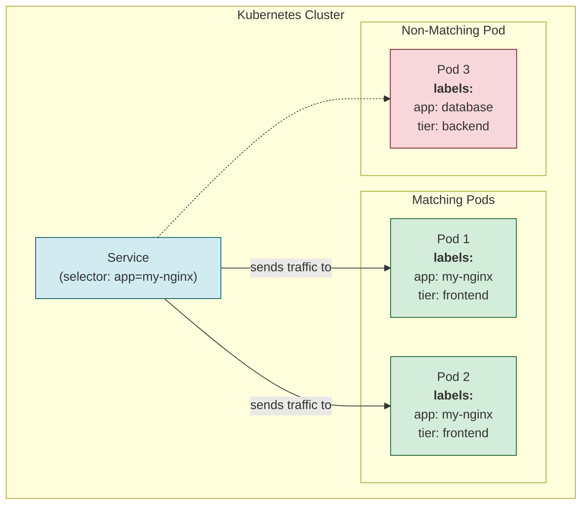

# 🏷️ Chapter 5: Labels and Selectors - The Art of Organization 🏷️

Welcome back, Champion! Mana last chapter lo objects ki `Names` and `UIDs` untayani chusam. But a name is for identifying *one specific object*. What if we want to find a *group* of objects? For example, "Show me all frontend pods" or "Show me all production databases".

Ikkade manaki **Labels and Selectors** daggara nunchi call vasthundi. 😎 Ee topic master cheste, nuvvu nee cluster ni oka pro la organize cheyochu.

**What we will learn in this chapter:**
-   What **Labels** are and why they are like magic hashtags for your objects.
-   What **Selectors** are and how they help us find objects with those hashtags.
-   The two types of selectors: Equality-Based and Set-Based.

## 1. What are Labels?

-   **Labels are key/value pairs** that you attach to Kubernetes objects (like Pods, Deployments, etc.).
-   **Analogy:** Think of them like **hashtags on Instagram or tags on a blog post**. They are for grouping things together.
-   They don't have any direct impact on the system's core behavior, but they are super useful for us (humans) to organize and select objects.
-   You can attach them when you create an object or add/modify them later.
-   **Important Rule:** Within a single object, each label **key** must be unique.

**Example Labels:**
-   `"release" : "stable"`
-   `"environment" : "production"`
-   `"tier" : "frontend"`
-   `"app" : "my-web-app"`

## 2. What are Selectors?

-   Labels pettadam first step aithe, aa labels ni use chesi objects ni filter cheyadam second step. Aa filtering panine **Selectors** chestayi.
-   Selectors anevi Kubernetes lo **core grouping primitive**. Higher-level objects like **Deployments**, **ReplicaSets**, and **Services** use selectors to know which Pods they should manage or send traffic to.
-   You can say, "Hey Kubernetes, give me all objects that have the label `environment: production`".

Ee diagram chudandi. Oka **Service** object (deeni gurinchi manam Networking section lo nerchukuntam), `app: my-nginx` ane selector ni use chesi, correct **Pods** ni ela find out chestundo chudochu.


*The Service only finds Pods that have the `app: my-nginx` label. It completely ignores Pod 3.*

## 3. Types of Label Selectors

Manaki rendu rakala selectors unnayi. This is a key distinction!

| Selector Type         | Operators Used            | Example                               | Analogy                     |
| --------------------- | ------------------------- | ------------------------------------- | --------------------------- |
| **Equality-Based**    | `=`, `==`, `!=`           | `environment=production`              | Simple and direct check     |
| **Set-Based**         | `in`, `notin`, `exists`   | `environment in (prod, qa)`           | Powerful group check        |

### a) Equality-Based Selectors
-   Evi simple and most common.
-   You can combine them with a comma (which acts as a logical **AND**).
    -   `environment=production,tier!=frontend`

### b) Set-Based Selectors
-   Evi konchem more powerful. You can filter based on a set of values.
-   **`in`**: Value must be in the given set.
-   **`notin`**: Value must NOT be in the given set.
-   **`exists`**: The label key must exist (value doesn't matter). You write this as just the key: `partition`.
-   **`!exists`**: The label key must NOT exist. You write this as `!partition`.

> **Important Gotcha:** There is **NO logical OR (||)** operator between different requirements. For example, you can't say `tier=frontend OR app=nginx`. You can only achieve OR on *values* using the `in` operator.

## 4. Example in Action: A Pod with Labels

Ee example `pod-with-labels.yaml` file lo chudandi, manam `metadata` lo labels ela isthamo.

```yaml
# API Version, manam v1 core API vaduthunnam.
apiVersion: v1
# Ee object 'Pod' ani cheptunnam.
kind: Pod
# Pod gurinchi metadata.
metadata:
  # Pod peru.
  name: label-demo
  # Ikkade asalu magic undi! The labels section.
  labels:
    # Ee Pod 'production' environment ki chendinadi.
    environment: production
    # Ee Pod 'nginx' app ki chendinadi.
    app: nginx
# Pod spec, ante Pod ela undali anedi.
spec:
  containers:
  - name: nginx
    image: nginx:1.14.2
    ports:
    - containerPort: 80
```

Ee pod create chesaka, manam ee commands tho filter cheyochu:
-   `kubectl get pods -l environment=production`
-   `kubectl get pods -l 'app in (nginx, apache)'`

> **🧠 Key Takeaway:** **Labels** are the stickers you put on your stuff. **Selectors** are the magic wand you use to find all the stuff with a specific sticker.

---

### Cliffhanger 🧗:

Labels are awesome for grouping and selecting objects. Kani, labels anevi system use cheyadaniki, queries ki. What if we want to add extra information to an object that is not meant for querying? For example, a description, a link to a monitoring dashboard, or the phone number of the person on-call?

Labels kosam idi vadithe, mana label list chala peddaga, messy ga aipothundi. For this, Kubernetes has another, similar-but-different tool. A tool for adding "non-identifying" metadata.

In our next chapter, we'll explore the silent sibling of Labels: **Annotations**! Get ready to add more context to your objects. ✍️🗒️
