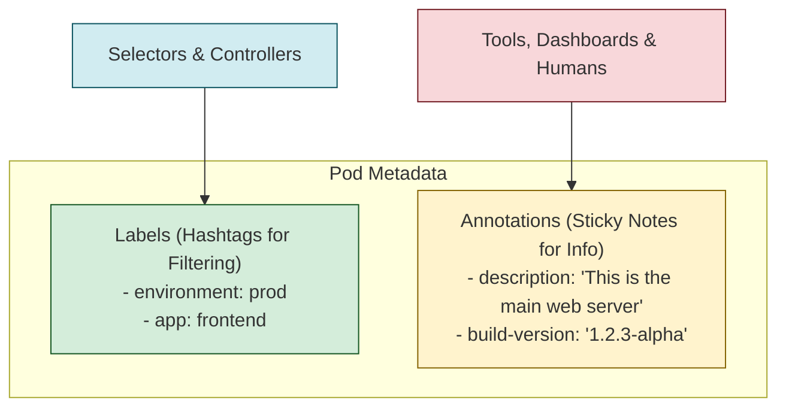

# 🗒️ Chapter 6: Annotations - The Sticky Notes of K8s 🗒️

Hello Champion! Last time manam **Labels** gurinchi nerchukunnam, which are like hashtags for selecting and organizing objects. But what if we want to add some extra info that is *not* for selecting? For example, a long description, a build number, or a link to a Grafana dashboard?

Labels lo ee info antha pedithe, adi chala messy ga and unmanageable ga aipothundi. Anduke, manaki K8s oka super cool feature ichindi: **Annotations**!

**What we will learn in this chapter:**
-   What Annotations are and how they differ from Labels.
-   The Golden Rule for when to use an Annotation vs. a Label.
-   Real-world use cases for annotations.

## 1. What are Annotations?

-   You can use annotations to attach **arbitrary non-identifying metadata** to objects.
-   **Main Difference:** Labels are for **selecting** objects. Annotations are **NOT** for selecting objects.
-   **Analogy:** Labels are like **hashtags** for filtering (`#production`, `#frontend`). Annotations are like the full **descriptive comments or sticky notes** you put on your stuff.
-   The metadata in annotations can be small or large, structured or unstructured.


*Ee diagram lo chudandi, Selectors only care about Labels. Annotations are for other tools or humans to read.*

## 2. The Golden Rule: Label or Annotation?

Ee okka rule gurthu pettuko mawa, neeku eppudu confusion raadu:

> **If you need to filter your objects based on this piece of metadata, use a `Label`. For everything else, use an `Annotation`.**

Simple as that! 🫡

## 3. When to use Annotations? (Use Cases)

Labels lo pettaleni extra information antha ikkada pettొచ్చు.
-   **Build/Release Info:** Timestamps, release IDs, Git branch, PR numbers, image hashes.
-   **Contact Info:** "Ee service fail aithe, ee team lead ki call cheyandi: 9876543210" lanti information.
-   **Dashboard Links:** Pointers to logging (`splunk-dashboard.com/query=...`), monitoring (`grafana-link`), or analytics dashboards.
-   **Tooling Metadata:** This is a big one! Tools like **Ingress controllers** or **cert-manager** use annotations to configure their behavior for a specific object. For example, an annotation on an Ingress object can tell the controller which type of load balancer to use.
-   **Descriptions:** A very long, detailed description of what the object does.

## 4. Syntax

The syntax is almost identical to labels. It's just a key-value map inside the `metadata` section, under the `annotations` key.

### Example: A Pod with Annotations

Ee `pod-with-annotations.yaml` file chudandi.

```yaml
# API Version, same as before.
apiVersion: v1
# Object kind is 'Pod'.
kind: Pod
# Metadata section lo Labels tho paatu, annotations kuda untayi.
metadata:
  # Pod peru.
  name: annotations-demo
  # Ikkada unnai mana sticky notes!
  annotations:
    # Ee annotation, ee object ni evaru create chesaro cheptundi.
    "owner": "JulesTheK8sMaster"
    # Ee object gurinchi inko tool ki info ivvadaniki.
    "imageregistry": "https://hub.docker.com/"
    # A long description about this pod.
    "description": "This is a demo pod to showcase annotations. It runs a simple nginx server."
# Pod specification, as usual.
spec:
  containers:
  - name: nginx
    image: nginx:1.14.2
    ports:
    - containerPort: 80
```

You **cannot** use `kubectl` to select this pod using its annotations. For example, `kubectl get pods -l owner=JulesTheK8sMaster` **will not work**. Annotations are for machines or humans to read, not for the Kubernetes selection mechanism.

---

### Cliffhanger 🧗:

Okay, so we now know how to identify and organize our objects with Names, UIDs, Labels, and Annotations. We are becoming true Kubernetes librarians! 📚

But so far, manam anni objects ni oka pedda box lo pettesthunnam. In a real project, you'll have multiple teams (frontend, backend, database) and multiple environments (dev, staging, prod). Anni oke chota unte chala confusion untundi.

How can we create **virtual clusters** inside our physical cluster to keep things separate and secure? How do we prevent the 'dev' team from accidentally deleting a 'production' service?

For this, Kubernetes gives us a powerful tool for isolation. In the next chapter, we will explore **Namespaces**! Get ready to divide and conquer! 🗺️
