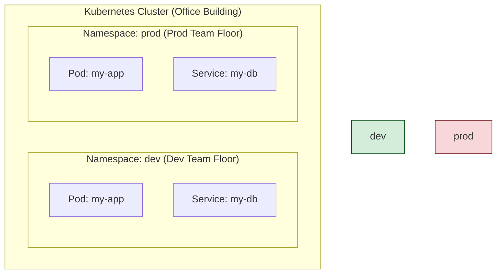

# 🗺️ Chapter 7: Namespaces - Divide and Conquer! 🗺️

Welcome back, Champion! So far, manam objects anni create chesam, kani antha oke chota (in the `default` namespace) chestunnam. Real-world projects lo, multiple teams and multiple environments (dev, qa, prod) untayi. Anni oke chota unte, chala godava avthundi! 😂

For this, Kubernetes gives us a powerful feature: **Namespaces**.

## 1. What are Namespaces?

-   Namespaces are a way to create multiple **virtual clusters** inside a single physical Kubernetes cluster.
-   **Analogy:** Think of your physical cluster as a big office building (Building K8s). A namespace is like renting an entire floor for a specific team (e.g., 'Finance-Floor', 'HR-Floor').
-   Each floor is isolated. The 'Finance' team's resources (desks, computers) are separate from the 'HR' team's resources.
-   They provide a **scope for names**. `desk-1` can exist on the Finance floor and a different `desk-1` can exist on the HR floor. No confusion!


*In this diagram, `my-app` Pod exists in both `dev` and `prod` namespaces without any conflict.*

## 2. When to Use Namespaces?

-   When multiple teams or projects share the same cluster.
-   To isolate resources. For example, the `dev` team shouldn't be able to accidentally delete a `prod` service.
-   To divide cluster resources using **ResourceQuotas**. For example, you can say the `dev` namespace can only use 10 CPUs and 20GB of RAM. (We will learn about ResourceQuotas later!)

## 3. Initial Namespaces

When you start a Kubernetes cluster, it already has 4 namespaces:
1.  **`default`**: Manam namespace specify cheyakapothe, anni objects ikkade create avthayi. Don't use this for real projects!
2.  **`kube-system`**: Kubernetes system components (like `etcd`, `kube-apiserver`) ikkada untayi. Ee namespace ni eppudu touch cheyoddu! 🙏
3.  **`kube-public`**: Ee namespace ni andaru (even unauthenticated users) read cheyochu. Mostly cluster usage kosam.
4.  **`kube-node-lease`**: Prathi node ki oka `Lease` object untundi, node health check (heartbeats) kosam.

## 4. Working with Namespaces

### Viewing Namespaces
Cluster lo unna anni namespaces chudalante:
```bash
kubectl get namespace
# or short version
kubectl get ns
```

### Creating a Namespace
Manam oka YAML file tho namespace create cheyochu. Let's see `namespace-dev.yaml`:

```yaml
# API version for namespace is v1
apiVersion: v1
# The kind of object is Namespace
kind: Namespace
# Metadata section lo, manam namespace ki peru istham
metadata:
  name: dev
```
**Command to apply:** `kubectl apply -f namespace-dev.yaml`

Alternatively, you can use a simple command:
```bash
kubectl create namespace dev
```

### Creating Objects in a Namespace
Oka object ni specific namespace lo create cheyadaniki, manam `metadata` lo `namespace` field add cheyali, or command line lo `--namespace` flag vadali.

**1. Using the `--namespace` flag (or `-n`):**
```bash
# Creates an nginx pod in the 'dev' namespace
kubectl run nginx --image=nginx --namespace=dev

# To see pods in that namespace
kubectl get pods --namespace=dev
```

**2. Setting the namespace preference for all future commands:**
Eppudu `--namespace=dev` ani type cheyadam kashtam anipisthe, you can set it as a default for your current context.
```bash
kubectl config set-context --current --namespace=dev
```
Ippati nunchi, `kubectl get pods` ante, adi automatic ga `dev` namespace lo chustundi.

## 5. Namespaces and DNS

This is a super important point!
-   Oka Service create chesinappudu, K8s oka DNS entry create chestundi.
-   The format is: `<service-name>.<namespace-name>.svc.cluster.local`
-   **Example:** `my-db` ane service `dev` namespace lo unte, daani full DNS name: `my-db.dev.svc.cluster.local`.
-   **Advantage:** If you are inside the `dev` namespace, you can just use the name `my-db` to connect to the service. If you are in another namespace (like `prod`) and want to connect to the `dev` database, you must use the full name `my-db.dev`.

---

### Cliffhanger 🧗:

Okay, we've learned how to organize our objects into different rooms (Namespaces). But what if we want to find objects based on their properties, not just their labels? For example, "Show me all pods that are in the 'Running' state" or "Show me all pods that are on 'node-1'".

Labels can't do this because they are static metadata. For this kind of dynamic, status-based filtering, Kubernetes provides another powerful tool.

In our next chapter, we will explore **Field Selectors**! Get ready to query your objects like a database pro! 🔎
