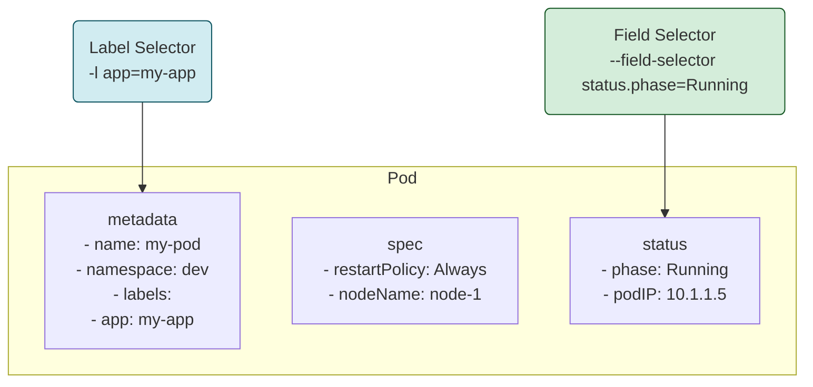

# 🔎 Chapter 8: Field Selectors - X-Ray Vision for Your Cluster! 🔎

Hey Champion! Manam Labels and Selectors tho mana objects ni organize cheyadam nerchukunnam. But avi manam ichina custom metadata (`app: frontend`) meeda work chestayi.

What if you want to select objects based on their **system properties**? For example, "Show me all Pods that are in the 'Running' state" or "Show me the Pod with the exact name 'my-app-pod-xyz'".

For this, we have **Field Selectors**!

## 1. What are Field Selectors?

-   Field Selectors allow you to select Kubernetes objects based on the **value of their fields**.
-   These fields are not defined by you, but by Kubernetes itself. They are part of the object's definition.
-   Think of it like a `WHERE` clause in a SQL query. You are querying the object's properties.

## 2. Label Selectors vs. Field Selectors

This is a very common interview question! Ee table chudandi, difference easy ga ardham avthundi.

| Feature                 | Label Selectors                               | Field Selectors                                   |
| ----------------------- | --------------------------------------------- | ------------------------------------------------- |
| **What it selects on**  | Custom metadata (key-value pairs) you add.    | System-defined object fields (`metadata`, `spec`, `status`). |
| **Analogy**             | Hashtags on a post (`#dev`, `#frontend`).     | The post's properties (author, date, like count). |
| **Flexibility**         | Very flexible. You can define any key/value.  | Limited to fields supported by the resource type. |
| **Supported Operators** | `=`, `==`, `!=`, `in`, `notin`, `exists`      | Only `=`, `==`, `!=`. (No `in`, `notin`, `exists`) |
| **`kubectl` flag**      | `-l` or `--selector`                          | `--field-selector`                                |


*Label selectors work on the `labels` part of `metadata`. Field selectors work on other fields like `metadata.name` or `status.phase`.*

## 3. How to Use Field Selectors

Field selectors ni manam `kubectl get` command lo `--field-selector` flag tho vadatham.

### Common Examples:

-   **Get all Pods that are in the 'Running' phase:**
    ```bash
    kubectl get pods --field-selector status.phase=Running
    ```

-   **Get a Pod with a specific name:** (Useful when you know the exact name)
    ```bash
    # Note: metadata.name is a field, not a label!
    kubectl get pods --field-selector metadata.name=my-app-pod-xyz
    ```

-   **Get all Services that are NOT in the `default` namespace:**
    ```bash
    kubectl get services --all-namespaces --field-selector metadata.namespace!=default
    ```

### Chaining Selectors

You can chain multiple field selectors together with a comma (`,`). This acts as a logical **AND**.

-   **Get all Pods that are NOT 'Running' AND have a restart policy of 'Always':**
    ```bash
    kubectl get pods --field-selector=status.phase!=Running,spec.restartPolicy=Always
    ```

### Using with Label Selectors

The real power comes when you combine both! You can use both `-l` and `--field-selector` in the same command.

-   **Get all 'production' Pods that are currently in the 'Succeeded' phase (like completed Jobs):**
    ```bash
    kubectl get pods -l environment=production --field-selector=status.phase=Succeeded
    ```

## 4. Supported Fields

**Important:** Prathi resource type ki anni fields selectable ga undavu.
-   `metadata.name` and `metadata.namespace` are selectable for ALL objects.
-   Other fields depend on the resource. For example, for Pods, you can select on `spec.nodeName`, `spec.restartPolicy`, `status.phase`, etc.
-   If you try to use an unsupported field, Kubernetes API server will give you an error.

---

### Cliffhanger 🧗:

We've mastered Names, UIDs, Labels, Selectors, Annotations, and now Field Selectors! We are true masters of Kubernetes metadata. 👑

But what happens when we delete an object? Does it just vanish instantly? What if an object needs to clean up some external resources (like a cloud load balancer) before it's deleted? If we just delete it, the external resource might be left behind, costing us money! 💸

To solve this, Kubernetes has a special mechanism, a "guardian" that prevents objects from being deleted until their cleanup tasks are done.

In our next chapter, we will learn about these guardians: **Finalizers**! Get ready to understand the graceful art of deletion. 💀➡️😇
