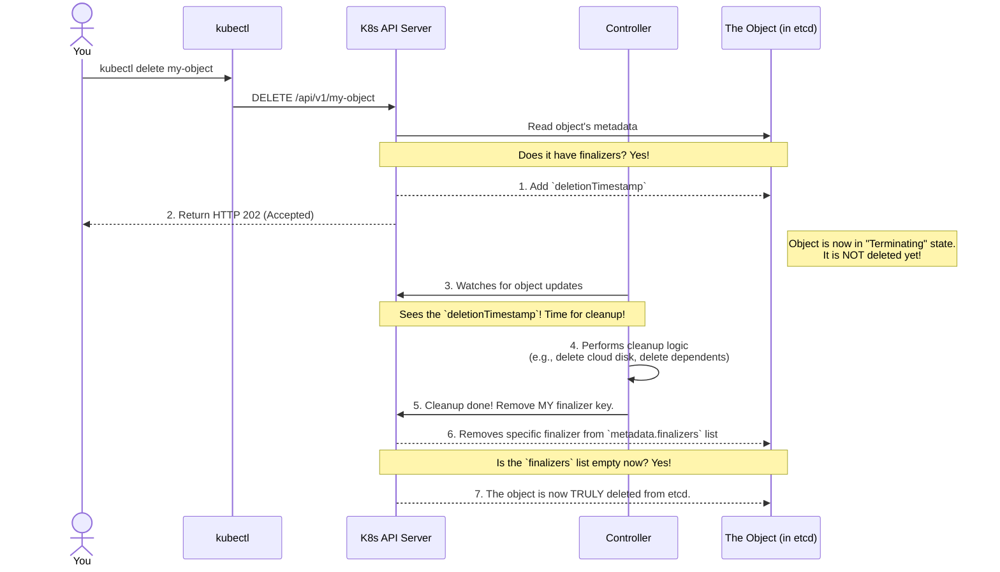

# 🛡️ Chapter 9: Finalizers - The Guardians of Deletion 🛡️

Hello Champion! Manam ippativaraku objects ni create cheyadam, organize cheyadam chusam. Kani delete chesetappudu em avthundi? What if an object needs to do some cleanup work before it disappears forever?

For example, oka `PersistentVolume` object ni delete cheste, daaniki link ayina cloud disk (like an AWS EBS volume) kuda delete avvali. Lekkunte, aa disk orphan aipoyi, manaki bill padthune untundi! 💸

Ee problem solve cheyadanike manaki **Finalizers** unnayi.

**What we will learn in this chapter:**
-   What Finalizers are and why they are the "guardians" of deletion.
-   The step-by-step flow of how Kubernetes handles deleting an object that has a finalizer.
-   A real-world example with Persistent Volumes.

## 1. What are Finalizers?

-   Finalizers are special keys that you add to an object's `metadata.finalizers` list.
-   They tell Kubernetes: "**Hey! Nannu delete chese mundu, konni panulu cheyali. Aa panulu ayyevaraku nannu delete cheyaku.**" (Before you delete me, some tasks need to be done. Don't delete me until they are finished).
-   Ee "cleanup work" anedi chala important. It could be deleting dependent objects (which we'll learn about in the next chapter on **Owners and Dependents**) or releasing an external resource like a cloud load balancer.
-   They act as **guardians** 🛡️, preventing accidental deletion of resources that still have cleanup to do.

## 2. How Finalizers Work (The Deletion Flow)

Manam `kubectl delete my-object` ani command ichinappudu, asalu process chala interesting ga untundi.

**Step-by-step Breakdown:**

1.  You run `kubectl delete`.
2.  The API server gets the request. It checks if the object has any `finalizers`.
3.  If it does, the API server **does not delete the object**. Instead, it just adds a `deletionTimestamp` to the object's metadata. The object is now in a `Terminating` state.
4.  The controller that manages that resource (and its finalizer) is always watching. It sees the `deletionTimestamp` and understands that it's time to do its cleanup job.
5.  The controller performs its logic (e.g., calls the cloud provider's API to delete a disk).
6.  Once the cleanup is successful, the controller sends another request to the API server to **remove its own finalizer key** from the `metadata.finalizers` list.
7.  The API server removes the key. It then checks if the `finalizers` list is now empty.
8.  Once the list is empty, Kubernetes knows all cleanup is done, and it finally deletes the object for good.

**Pro Tip 🕵️‍♂️:** Sometimes an object gets stuck in the `Terminating` state. This usually means a controller is unable to remove its finalizer. You can find these stuck objects using the **Field Selector** we learned about in the last chapter! `kubectl get all --field-selector metadata.deletionTimestamp!=""`

## 3. An Example: `kubernetes.io/pv-protection`

-   A very common finalizer is `kubernetes.io/pv-protection`.
-   When you attach a `PersistentVolume` (which we'll learn about in the `Storage` section) to a Pod, Kubernetes automatically adds this finalizer to the `PersistentVolume` object.
-   If you try to delete the `PersistentVolume` while a Pod is still using it, the finalizer will be present. The deletion will be blocked. The `PV` will be stuck in the `Terminating` state.
-   Once you detach the Pod from the volume, the controller will see that it's safe to delete, remove the finalizer, and the `PV` will be deleted. This prevents data loss!

> **CRITICAL WARNING:** ☠️ Never manually remove finalizers unless you are 100% sure you know what you are doing and have manually cleaned up the dependent resources. Forcibly removing a finalizer can lead to orphaned resources, security issues, and unnecessary costs.

---

### Cliffhanger 🧗:

Finalizers are all about cleaning up resources that an object *owns*. This brings up a very interesting question. How does Kubernetes know that one object "owns" another? How does a `ReplicaSet` know which `Pods` belong to it? If you delete the `ReplicaSet`, how does Kubernetes know to delete its Pods too?

This parent-child relationship is fundamental to how Kubernetes manages automated resources.

In our next chapter, we'll explore the family tree of Kubernetes: **Owners and Dependents**! Get ready to understand the hierarchy. 👨‍👩‍👧‍👦
