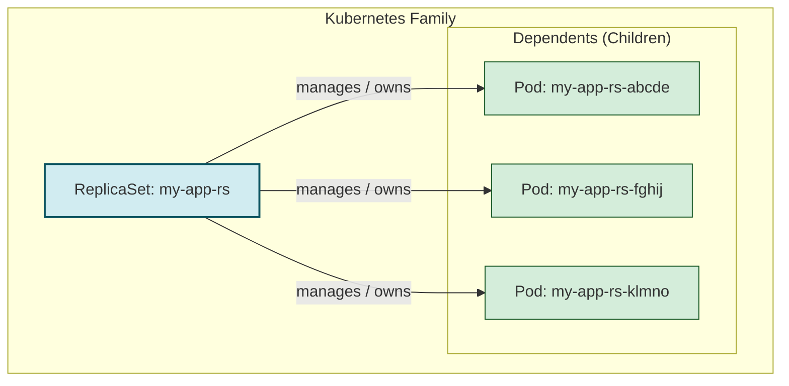

# 👨‍👩‍👧‍👦 Chapter 10: Owners and Dependents - The Kubernetes Family Tree! 👨‍👩‍👧‍👦

Namaste, Champion! Mana last chapter lo Finalizers gurinchi matladukunnam, avi resources ni delete chese mundu cleanup ki help chestayani. Aa cleanup lo "dependent resources" ni delete cheyadam kuda untundi.

But asalu ee "dependent" ante enti? How does Kubernetes know that one object is the parent (owner) and others are its children (dependents)? 🤔

Ee chapter lo manam Kubernetes family relationships gurinchi nerchukundam. This is the secret behind how K8s manages everything so automatically! Ready to meet the family? 🤗

## 1. What are Owners and Dependents?

Simple ga cheppalante, Kubernetes lo konni objects inko objects ki "parents" la act chestayi.
-   **Owner:** The parent object. (e.g., a `ReplicaSet`).
-   **Dependent:** The child object. (e.g., the `Pods` created by the `ReplicaSet`).

Ee relationship valla, oka parent ni delete cheste, daani children kuda automatic ga delete aipothayi. No more orphan objects! 🙏



## 2. The Magic Link: `ownerReferences`

Ee parent-child relationship ela create avthundi? The magic is in the `metadata` of the dependent object.
-   Prathi dependent object yokka `metadata` lo **`ownerReferences`** ane oka field untundi.
-   Ee field lo parent (owner) object gurinchi information untundi, including its `name` and most importantly, its **`UID`**.
-   Manam `ReplicaSet` create chesinappudu, K8s controller automatic ga Pods ni create chesi, aa Pods `metadata` lo ee `ownerReferences` block ni add chestundi. Manam idi manually cheyalsina avasaram ledu!

Here's how it looks inside a Pod's YAML (idi system automatic ga add chestundi):
```yaml
apiVersion: v1
kind: Pod
metadata:
  name: my-app-rs-abcde
  # ... other metadata ...
  ownerReferences:
  # Ee section ni K8s automatic ga add chestundi!
  - apiVersion: apps/v1
    kind: ReplicaSet
    name: my-app-rs  # Owner peru
    uid: 72e53594-af1c-4573-a2a7-68887a41280d # Owner యొక్క UID, idi most important!
    controller: true
    blockOwnerDeletion: true # Ee dependent ni delete chesevaraku owner ni delete cheyoddu ani அர்த்தం
```

## 3. The Main Purpose: Garbage Collection & Cascading Deletion

Ee ownership concept ki asalu reason **Garbage Collection**. Ante, anavasaramaina objects ni automatic ga clean cheyadam.
-   When you delete an owner object, the garbage collector sees it and automatically deletes its dependent objects too.
-   Ee process ni **Cascading Deletion** antaru.

Manaki ee Cascading Deletion lo 3 types unnayi (these are called propagation policies):

### a) Background Cascading Deletion (Default)
-   **Meaning:** "Parent ni ventane delete chey, pillalni (dependents) background lo மெల్లగా delete chey."
-   Idi default behavior. It's fast for the user.
-   **Flow:**
    1. You send `kubectl delete replicaset my-app-rs`.
    2. The ReplicaSet is deleted immediately.
    3. The garbage collector then starts deleting the dependent Pods in the background.

### b) Foreground Cascading Deletion
-   **Meaning:** "Wait! First, na pillalandarini delete chey. Vallu andaru poyaka, appudu nannu delete chey."
-   This is safer, especially when dependents have their own cleanup to do.
-   **Flow:**
    1. You send `kubectl delete replicaset my-app-rs --cascade=foreground`.
    2. The ReplicaSet enters a "deletion in progress" state. It gets a `deletionTimestamp` and a special `foregroundDeletion` finalizer.
    3. The controller deletes all the dependent Pods.
    4. Only after all dependents are gone, the ReplicaSet object itself is finally deleted.

### c) Orphan Deletion
-   **Meaning:** "Nannu delete chey, kani na pillalni emi cheyaku. Let them live."
-   The owner is deleted, but the dependents become "orphans" and are not deleted.
-   You can achieve this with `kubectl delete replicaset my-app-rs --cascade=orphan`.

Here's a diagram to show the difference between Foreground and Background deletion:

```mermaid
sequenceDiagram
    actor You
    participant K8s as Kubernetes API

    box LightBlue Background Deletion (Default)
        You->>K8s: DELETE ReplicaSet
        K8s-->>You: OK, ReplicaSet deleted! (Fast Response)
        K8s->>K8s: (Later...) Delete dependent Pods
    end

    box LightGreen Foreground Deletion
        You->>K8s: DELETE ReplicaSet (Foreground)
        K8s->>K8s: 1. Add 'foregroundDeletion' finalizer to ReplicaSet
        K8s->>K8s: 2. Delete dependent Pods
        K8s-->>K8s: 3. Pods confirmed deleted
        K8s->>K8s: 4. Remove finalizer & delete ReplicaSet
        K8s-->>You: OK, everything is deleted. (Slower Response)
    end
```

## 4. Important Gotcha: Cross-Namespace Ownership
-   This is a strict rule: **An owner and its dependent MUST be in the same namespace!** (or both must be cluster-scoped).
-   `dev` namespace lo unna ReplicaSet, `prod` namespace lo unna Pod ki owner avvaledu.
-   This is a security and isolation feature. It prevents chaos! 😂

---

### Cliffhanger 🧗:

Awesome! Mana K8s family tree gurinchi, and automatic cleanup gurinchi thelusukunnam. We now understand how Kubernetes uses `ownerReferences` to manage object lifecycles.

Kani manam `labels` gurinchi matladinappudu, avi manam istam vachinattu pettukovachu annam. Is there a standard way? Are there some "recommended" labels that everyone in the Kubernetes community uses? Using such labels can make our applications work better with standard tools like Helm and kubectl.

In our next chapter, we will explore the **Recommended Labels**! Get ready to make your objects speak a universal language that every tool understands. 🌍🏷️
