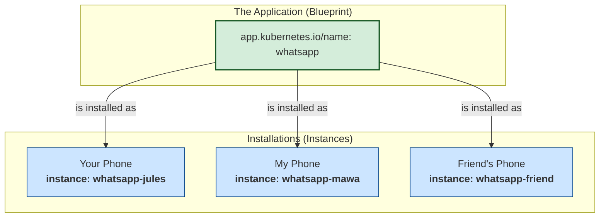
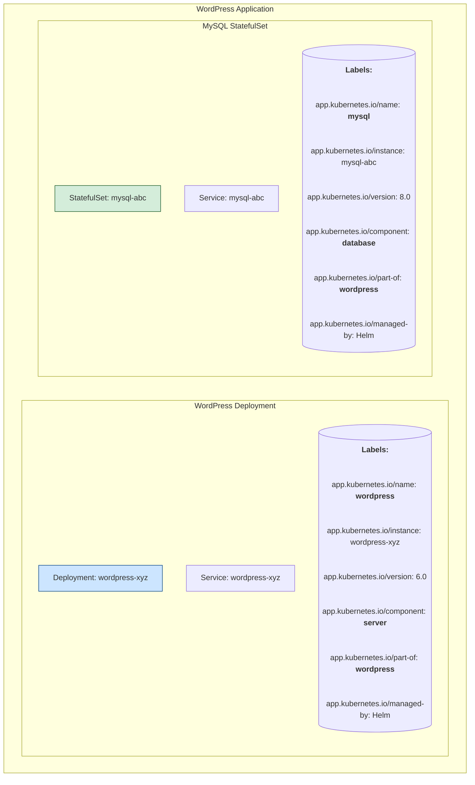

# 🤝 Chapter 11: Recommended Labels - The K8s Secret Handshake! 🤝

Yo Champion! Welcome back to the main stage! In **Chapter 5**, manam **Labels** gurinchi nerchukunnam. We learned that we can put any key-value pairs we want. Kani oka chinna twist undi.

Imagine manam andaram friends, kani prathi okkaru oka kotha secret language lo matladuthunnaru. Communication chala kashtam kada? 😂 Alaage, manam andaram mana istaniki labels pedithe, mana cluster ni manage chese tools (like Helm, Kustomize, or cool dashboards) ki adi em application o, daani parts ento ardham kaadu.

Ee problem solve cheyadanike, Kubernetes peddalu manaki konni **Recommended Labels** icharu. Ee labels use cheyadam anedi oka universal language lo matladinattu. It's the secret handshake of the pros! 🫡

**What we will learn in this chapter:**
-   Why standardized labels are important.
-   The full list of recommended labels and what each one means.
-   A deep-dive into the most confusing part: the difference between `name` and `instance`.

## 1. Why Should We Care? The Superpower of Standardization 🦸‍♂️

Ee recommended labels use cheyadam compulsory kadu, kani chesthe manake chala manchidi.
-   **Tool Interoperability:** Mana `kubectl`, `Helm`, dashboards lanti tools anni ee standard labels ni ardham cheskuni, mana application ni automatic ga organize chesi chupisthayi.
-   **Clear Description:** Evaraina kotha person mana project chusina, ee labels chusi "Aha! Ee application peru idi, deeni version idi, idi ee component" ani easy ga ardham cheskuntaru.

## 2. The Golden Prefix: `app.kubernetes.io/`

Anni recommended labels ki ee common prefix untundi: `app.kubernetes.io/`.
-   **Why?** Ee prefix valla, ee standard labels manam create chese custom labels (e.g., `my-team: backend-devs`) tho clash avvakunda untayi. Chala neat arrangement!

## 3. The Recommended Labels List - Meet the Gang!

Ippudu asalu matter ki vaddham. Here are the most important recommended labels:

-   🏷️ **`app.kubernetes.io/name`**: The name of the application (e.g., `mysql`, `wordpress`).
-   🏷️ **`app.kubernetes.io/instance`**: A unique name for a specific installation of the application (e.g., `wordpress-blog-1`).
-   🏷️ **`app.kubernetes.io/version`**: The current version of the application (e.g., `5.7.21`).
-   🏷️ **`app.kubernetes.io/component`**: The role of this specific unit within the architecture (e.g., `database`, `webserver`).
-   🏷️ **`app.kubernetes.io/part-of`**: The name of a higher-level application this one is part of (e.g., `mysql` is `part-of` `wordpress`).
-   🏷️ **`app.kubernetes.io/managed-by`**: The tool being used to manage the application (e.g., `Helm`, `kubectl`).

### A Deeper Dive: `name` vs. `instance` (The WhatsApp Analogy 📱)

Ee `name` vs `instance` anedi konchem confusing ga anipinchavachu, so let's clear it up with a solid example that you requested.

-   **`name` = The Blueprint:** Think of this as the original WhatsApp application itself. The brand, the software, the idea of "WhatsApp". So, the label would be: `app.kubernetes.io/name: whatsapp`.
-   **`instance` = The Installation:** Now, you install this app on your phone, I install it on mine. We are both using the same "WhatsApp" (`name`), but your installation (`instance`) is separate from my installation. Your chats are yours, mine are mine. That unique installation is the `instance`.

Ee diagram chuste, 100% clear aipothundi:

**Final Rule:**
-   `name`: **What** is the software? (e.g., `whatsapp`, `mysql`, `wordpress`).
-   `instance`: **Which specific installation** of that software is this? (e.g., `whatsapp-jules`, `mysql-for-my-blog`, `wordpress-for-my-shop`).

## 4. Example in Action: The WordPress Army!

Oka WordPress site ni deploy chestunnam anukundam. Daaniki oka web server (WordPress) and oka database (MySQL) kavali. Ee labels tho aa setup ni entha beautiful ga describe cheyొచ్చో chudandi.

Ee diagram lo chudandi, rendu components (`server`, `database`) unnai, kani rendu kuda `part-of: wordpress` ane label valla, oke application ki chendinavi ani manaki clear ga telustondi. This is the power of standard labels! 🔥

> **🧠 Key Takeaway:** Recommended labels are not required, but they are a **best practice**. They are the universal language that allows your tools and your team to understand the structure of your applications without having to guess.

---

### Cliffhanger 🧗:

Superb, Champion! We have now truly mastered how to describe, organize, and manage our Kubernetes objects with Names, UIDs, Labels, Annotations, and now, the pro-level Recommended Labels. Mana metadata game ippudu top-notch! 💯

Kani... ippativaraku manam `kubectl` tho commands isthunnam, YAML files apply chestunnam. Asalu ee `kubectl` velli evaritho matladuthundi? How does it tell the cluster, "Hey, create this Pod!"? What is this magical entity called the **API Server** that we keep mentioning?

In our next chapter, we are going behind the scenes. We will open the main door of the Kubernetes control plane and meet the king himself: **The Kubernetes API**. Get ready to understand how everything *really* works! It's going to be mind-blowing! 🤯
