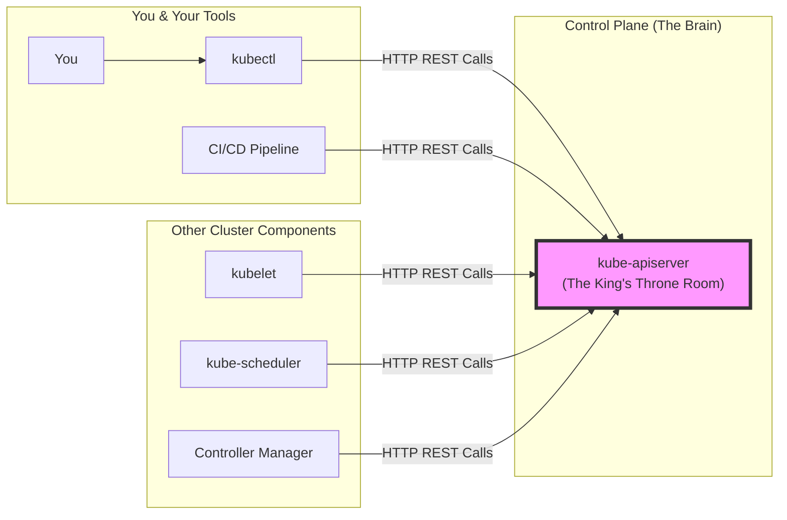
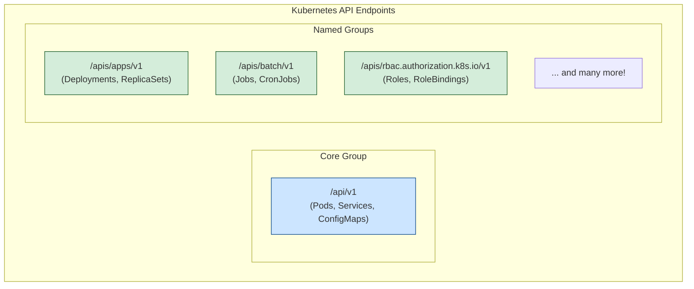
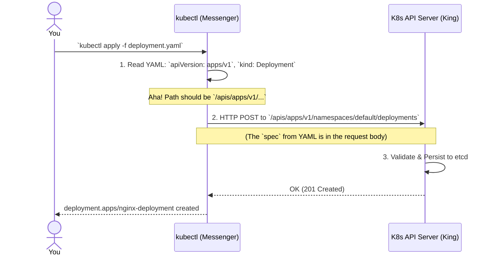

# 👑 Chapter 12: The Kubernetes API - The King of the Cluster! 👑

Namaste, Champion! Mana journey lo ippativaraku manam `kubectl` ane powerful sword ni use chesi objects ni create chesam, chusam, delete chesam. Kani asalu aa sword, kingdom lo unna King tho ela matladuthundi? Who is this King? 🤔

The King is the **Kubernetes API**! And the `kube-apiserver` (which we met in **Chapter 2**) is his throne room. Ee chapter lo manam aa King ni kalisi, aa kingdom secrets anni thelusukundam. This is one of the most important chapters. Konchem extra focus pettu, the payoff will be huge! Let's go! 🚀

**What we will learn in this chapter:**
-   Why the API is the true center of the Kubernetes universe.
-   How the API is organized into `Groups` and `Versions`.
-   How a simple `kubectl apply` command is translated into a REST API call.

## 1. What is the Kubernetes API?

Simple ga cheppalante, **The Kubernetes API is the front door to our Kubernetes cluster.**
-   Cluster lo ye change cheyalanna—oka Pod create cheyalanna, oka Service ni delete cheyalanna—maname kaadu, cluster loni vere components kuda ee API door daggara ki vachi permission adagali.
-   It's a **RESTful API** that works over HTTP. Ante, manam simple HTTP requests (GET, POST, PUT, DELETE) tho cluster state ni manage cheyochu.
-   `kubectl` is just a fancy client (mana messenger boy) that makes these HTTP calls for us.
-   The API Server processes these requests, validates them, and then stores the state of the objects in **`etcd`**, the cluster's database.

*Andaru, andaru API Server thone matladali. No one gets to talk to `etcd` directly!*

## 2. API Groups and Versioning - The Royal Library 📚

The Kubernetes API is not one single, giant API. Adi chala peddadi kabatti, దాన్ని chala neat ga organize chesaru using **API Groups** and **Versions**.

### API Groups
-   Related functionalities ni oka group lo pedatharu.
-   **Analogy:** Think of it like departments in a big company. `apps` anedi oka department, `rbac.authorization.k8s.io` anedi security department, `storage.k8s.io` anedi storage department.
-   The most common objects like **Pods**, **Services**, and **Namespaces** belong to a special **"core"** group.
-   **Endpoint Structure:**
    -   For the core group: `/api/v1`
    -   For all other groups: `/apis/GROUP_NAME/VERSION` (e.g., `/apis/apps/v1`)

### API Versions
-   Prathi API Group lo versions untayi. This allows Kubernetes to introduce new features or change existing ones without breaking everything.
-   **`v1` (GA - General Availability):** Rock solid, stable, long-term support. Mana Nannagaru lantiది. Full promise! 💪
-   **`v1beta1`:** Almost stable, well-tested. Future lo konni chinna changes undochu, kani mostly safe to use. Mana Annayya lantiది.
-   **`v1alpha1`:** Experimental, for testing new features. Warning! Evi eppudaina maripovachu or remove cheyochu. Use with caution! Mana chinnప్పటి friend gadi lantiది, eppudu ela untado telidu. 😂

Ee `apiVersion` field manam prathi YAML file lo top lo define chestam kada (e.g., `apiVersion: apps/v1` for a **Deployment**), daani asalu ardham ide! We are telling `kubectl` which department and which rulebook version to use.

## 3. How `kubectl` Uses the API

Ippudu asalu magic chudandi. Manam `kubectl apply -f deployment.yaml` ani kottinappudu, behind the scenes em jarugutundo chuddam.

Anthe, Champion! `kubectl` antha pedda magician emi kaadu, adi just manaki API Server ki madhya unna oka smart, rule-following messenger. 😎

## 4. Extending the API

The beauty of Kubernetes is that you can add your own custom APIs!
-   **Custom Resource Definitions (CRDs):** Idi chala easy way. You can tell Kubernetes about your own object type (e.g., `kind: Database`).
-   **Aggregation Layer:** This is a more advanced method where you can run your own API server and plug it into the main K8s API.

Ee rendu topics chala advanced. Manam future lo "Extending Kubernetes" ane pedda chapter lo deeni gurinchi detail ga matladukundam. For now, just remember that the API is extendable.

> **🧠 Key Takeaway:** Everything in Kubernetes is an API object. Every action you take with `kubectl` is a structured REST API call to a specific endpoint determined by the object's `apiVersion` and `kind`.

---

### Cliffhanger 🧗:

Phew! We've just unlocked the secrets of the Kubernetes control plane's main entrance. We know how to talk to the King! 👑

But a kingdom is nothing without its land and its people. The API server gives commands, but where do these commands get executed? Where do our containers actually live and breathe? On what machines do they run?

In our next chapter, we will leave the King's throne room and travel to the lands of the kingdom. We will explore the anatomy of the worker machines: the **Nodes**! Get ready to get your hands dirty with the real workhorses of Kubernetes! 🏗️🛠️
